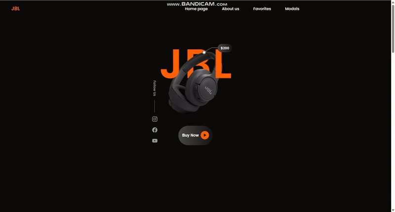

<h1> JBL Clone </h1>

JBL Clone, modern ve şık bir tasarıma sahip, responsive bir web sitesi projesidir. SCSS kullanılarak hazırlanan bu proje, dinamik ve bakımı kolay bir stil yapısı sunar. Kullanıcı dostu bir arayüz ile JBL markasına benzer bir deneyim hedeflenmiştir.

<h2> Kullanılan Teknolojiler </h2>

-HTML5

-SCSS (SASS)

-JavaScript

<h2> Özellikler </h2>

-Kullanıcı dostu ve modern tasarım

-SCSS ile modüler ve optimize edilmiş stil yapısı

-Mobil, tablet ve masaüstü cihazlarla uyumlu responsive tasarım

-Temiz ve okunabilir kod yapısı

